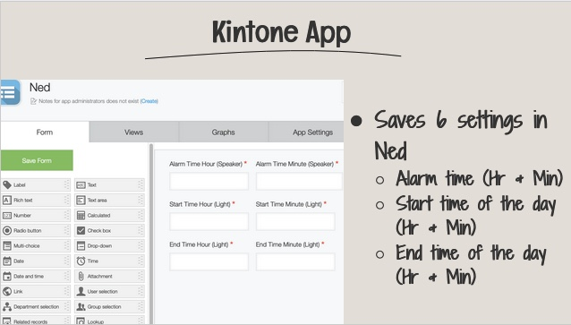
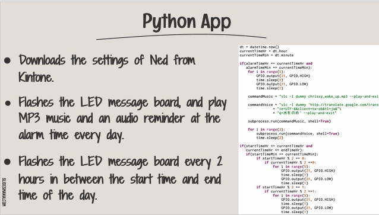
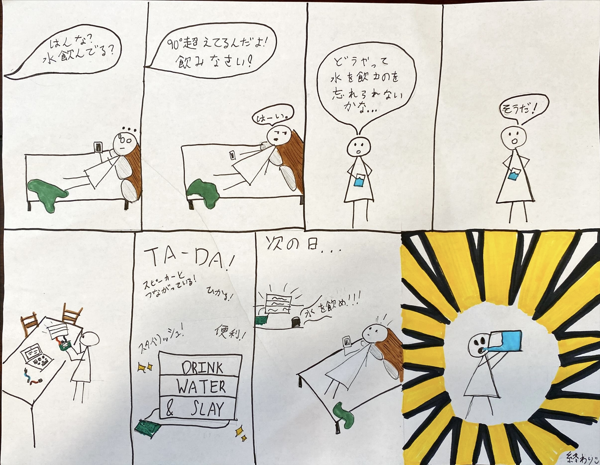
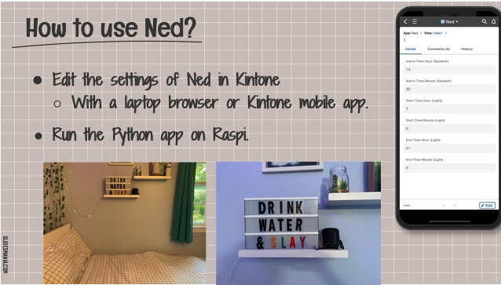

# Ned: The Hydration Reminder 

This is a Raspberry Pi device that reminds the user to hydrate. It periodically reminds him/her by flashing a message board and playing music and an audio suggestion. 

## Equipment

- Raspberry Pi Zero
- LED Messaging Board
- Bluetooth Speaker

## Hardware Setup

- Connected an LED message board to Raspi
- Connected Rapi to a speaker via Bluetooth

## Software Setup

- Made a Kintone database app to save several settings of Ned
- Made a Python app to run Ned

  
  

## Life with Ned 

  

## Demo

  

https://user-images.githubusercontent.com/74394277/223197867-abc580cb-cf6c-4fa4-b6c3-a36d0a6dc205.mp4

